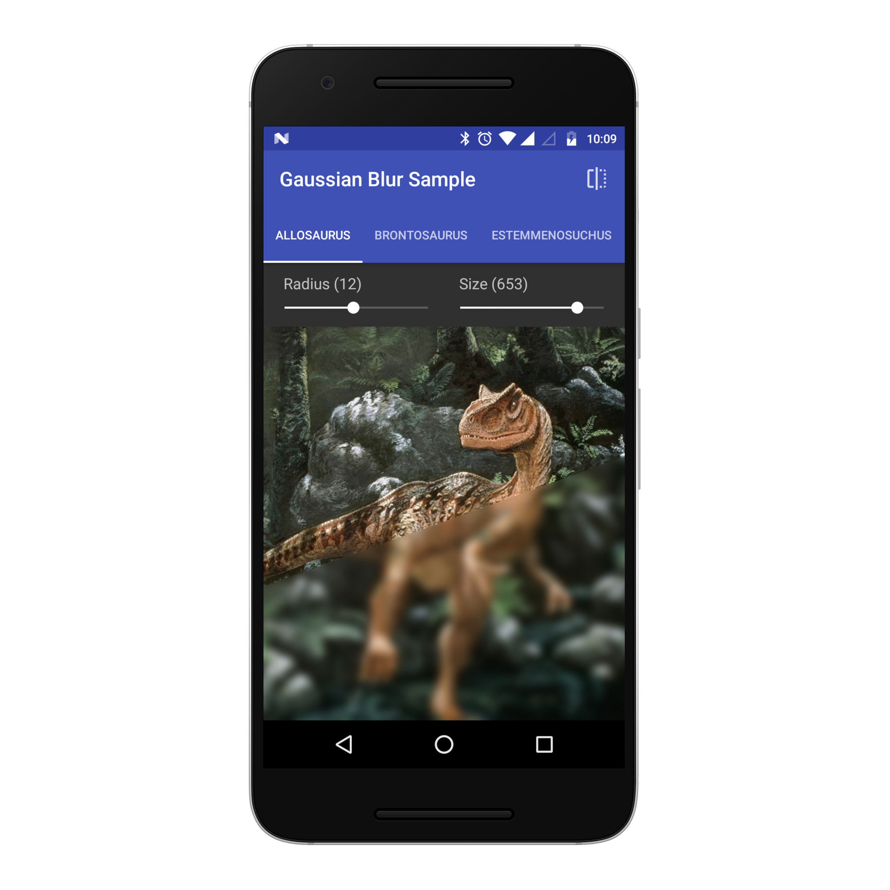
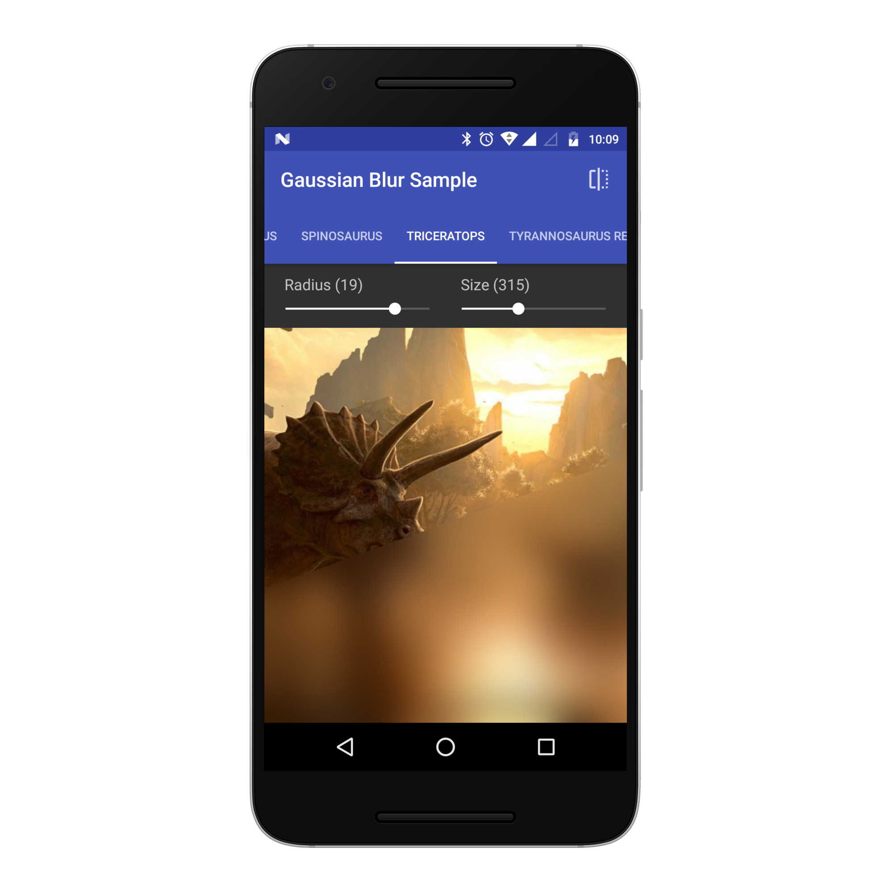
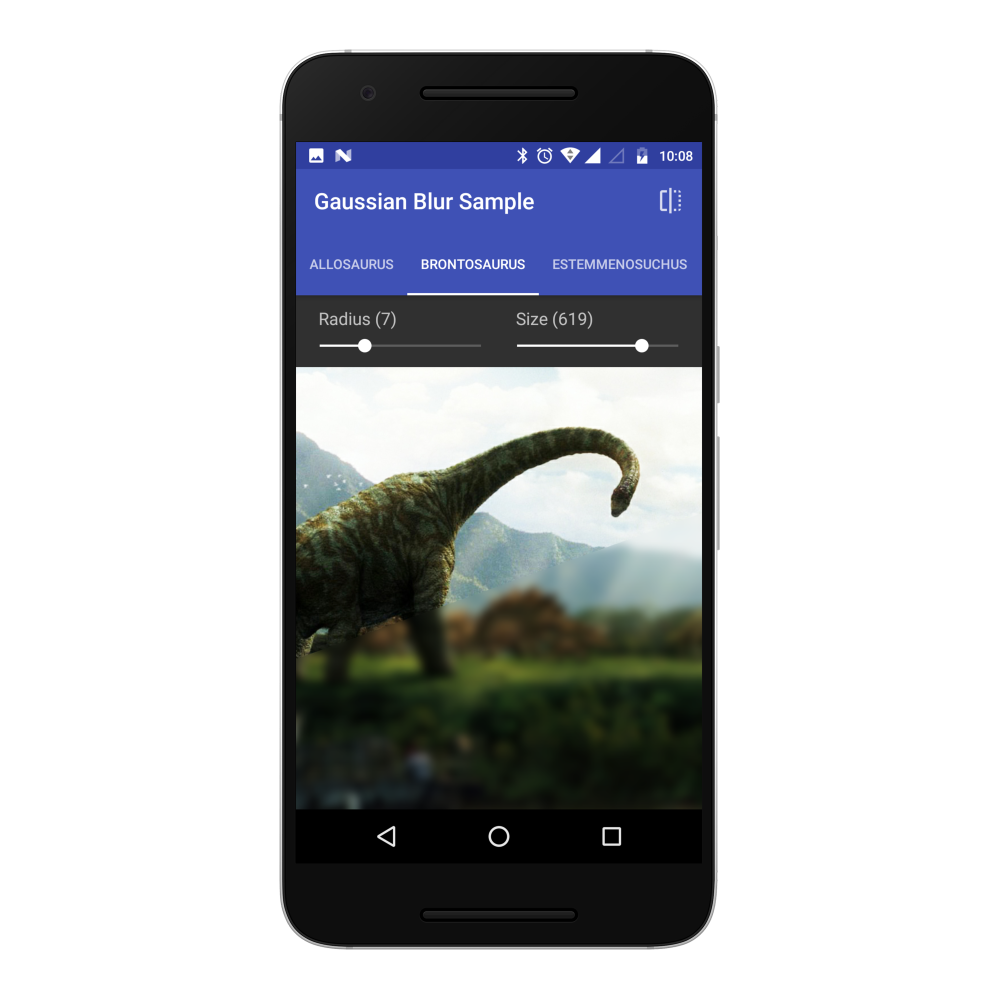
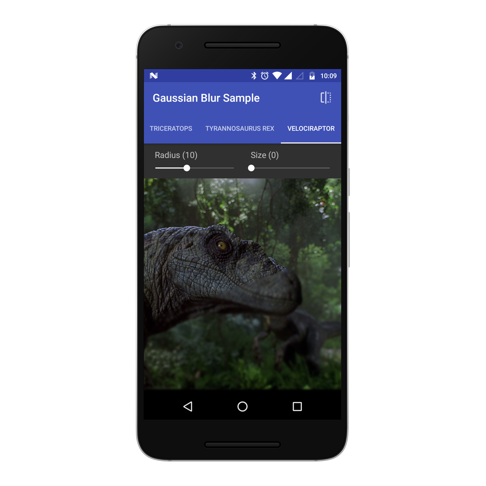

<!-- Library Logo -->


<a href='https://play.google.com/store/apps/details?id=com.vansuita.materialabout.sample&pcampaignid=MKT-Other-global-all-co-prtnr-py-PartBadge-Mar2515-1' target='_blank' align="right"></a>
<a href='https://ko-fi.com/A406JCM' target='_blank' align="right"></a>
<a href='https://beerpay.io/jrvansuita/GaussianBlur' target='_blank' align="right"></a>
# Gaussian Blur


This is an [**Android**](https://developer.android.com) project. Easy and simple library to apply gaussian blur filter on images. The library lets you apply a fast gaussian blur filter on any images very fast because the image will be scaled down before apply the filter. Doing it asynchronous or not.

</br>

<!-- JitPack integration -->
[](https://jitpack.io/#jrvansuita/GaussianBlur)

</a><!-- Android Arsenal -->
[](https://android-arsenal.com/details/1/4573) [](https://www.uplabs.com/posts/MaterialAbout)<!-- License -->
<a target="_blank" href="/LICENSE.txt"></a><!-- Minimun Android Api -->
<a target="_blank" href="https://developer.android.com/reference/android/os/Build.VERSION_CODES.html#GINGERBREAD"></a> [](https://www.codacy.com/app/jrvansuita/GaussianBlur?utm_source=github.com&amp;utm_medium=referral&amp;utm_content=jrvansuita/GaussianBlur&amp;utm_campaign=Badge_Grade) <!-- Apptize.io -->[](https://appetize.io/embed/7j6x11afygur1cn94zbme5dp1w?device=nexus7&scale=50&autoplay=true&orientation=portrait&deviceColor=black) [](http://apk-dl.com/dl/com.vansuita.gaussianblur.sample) <!-- Hits Count -->[](https://ghit.me/repo/jrvansuita/GaussianBlur)

# Screenshots






# Setup

#### Step #1. Add the JitPack repository to your build file:

```gradle
allprojects {
    repositories {
        ...
        maven { url "https://jitpack.io" }
    }
}
```

#### Step #2. Add the dependency ([See latest release](https://jitpack.io/#jrvansuita/GaussianBlur)).

```groovy
dependencies {
    compile 'com.github.jrvansuita:GaussianBlur:+'
}
```

#### Step #3. Add the below lines on app module build.gradle file.

```groovy
defaultConfig {
    ...
    renderscriptTargetApi 19
    renderscriptSupportModeEnabled true
}
```

# Implementation

```java
//Synchronous
Bitmap blurredBitmap = GaussianBlur.with(context).radius(25).render(R.mipmap.your_image);
imageView.setImageBitmap(blurredBitmap);
    
//Synchronous - Only scaleDown
Bitmap scaledDownBitmap = GaussianBlur.with(context).size(50).scaleDown(R.mipmap.your_image);
imageView.setImageBitmap(scaledDownBitmap);
    
//Asynchronous blur
GaussianBlur.with(context).size(400).radius(25).put(R.mipmap.your_image, imageView);
 ```
   
    
# Sample app code.
 Please check the sample app and feel free to help with a pull request. You can take a look at the sample app [located on this project](/app/).

#

<a href="https://plus.google.com/+JuniorVansuita" target="_blank">
  
</a>
<a href="https://www.linkedin.com/in/arleu-cezar-vansuita-júnior-83769271" target="_blank">
  
</a>
<a href="https://www.instagram.com/jnrvans/" target="_blank">
  
</a>
<a href="https://github.com/jrvansuita" target="_blank">
  
</a>
<a href="https://play.google.com/store/apps/dev?id=8002078663318221363" target="_blank">
  
</a>
<a href="mailto:vansuita.jr@gmail.com" target="_blank" >
  
</a>
